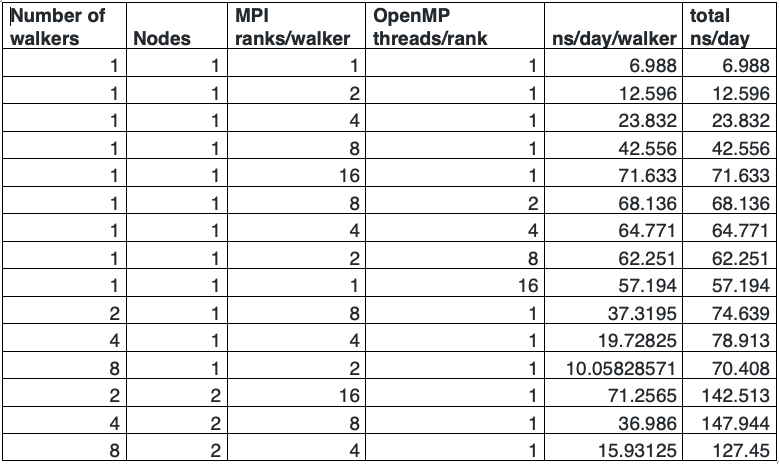

Nida Janulaitis \
2-25-20 \
Molsim HW7: parallel computing

For the first part of the table, as the number of mpiranks is increased, the number of ns/day increases because the reanks essentially divide up the code and perform different parts, which speeds up the process. For a constant number of ranks, if the number of threads is increased, the number of ns/day increases because the threads can perform separate tasks simultaneously. When the number of walkers is increased, the number of ns/day increases initially but then once 8 walkers are added the number of ns/day decresses because communication between walkers slows down the simulation. Increasing the number of nodes significantly increased the speed of the computation. When the number of walkers is increased for the runs using 2 nodes, the speed decreases when 8 walkers are added. This is, again, because communication between walkers, and, in this case, also nodes, slows down the process. 

